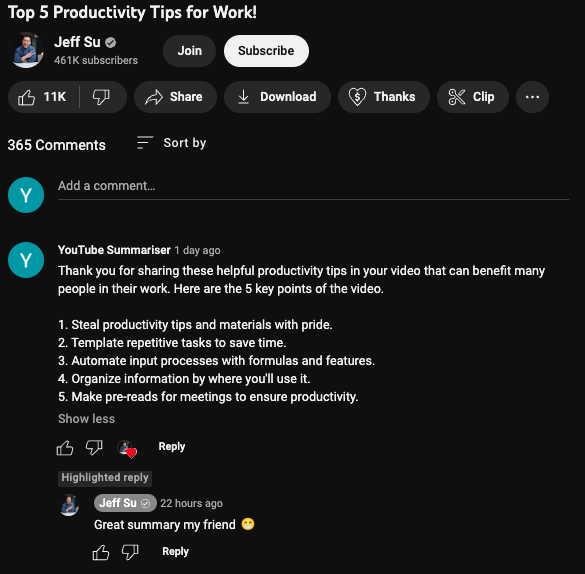

# YouTube Summariser

A GPT-based YouTube bot that leaves lovely comments with summaries of key points from YouTube videos.

https://user-images.githubusercontent.com/85243209/232094172-9dcd0972-026f-48c9-9880-ead306c90aee.mp4

# Setup

### Environment

Create the environment:

```
conda env create -f environment.yaml
conda activate yt-summariser
```

Set environment variables (replace `zshrc` with `bash_profile` if that's what you use):

```
echo "export OPENAI_KEY="imyouropenaikey"" >> ~/.zshrc
echo "export POSTGRES_PASSWORD="imyourpostreskey"" >> ~/.zshrc
source ~/.zshrc
```

Create the database:

```
python create_db.py
```

### Google API

0. Add `secrets` folder to `bot`. This is where Google API authentication will be stored.

1. You need to create an account at Google Developers.
2. Go to `Google Cloud` > `Console`.
    * create a new project (top of the page)
3. Go to `API & Services` (left menu) > `Enable APIs and Services` > search for `YouTube API`.
    * make sure you are at the right project, then `Enable the API`
    * go to `Credentials` > `Create Credentials` > `OAuth client ID`
4. This should prompt you to `Configure consent screen` do it, keep clicking next and fill up the application name (any name).
5. Now you can get `OAuth client ID`.
    * `make sure to choose Desktop`, otherwise the authentification process is a bit more complicated
    *  download the secrest file, that's your `secrets/client_secret_desktop.json`
6. Make sure to enable the bot's (or your own) gmail address as one of users permitted to use the app (you can add up around 100 emails there).
7. The API gives you 10 000 credits a day for free, which should equal to around 100 published comments or so.

# Background on the problem

I noticed a tendency from YouTube creators to make videos that consists of a few key points ("5 tips on xyz"). My intuition there is that this leads to more engagment from videos as people keep waiting to hear about the next point instead of switching tabs. People then usually comment on these videos where they summarise key points and get a lot of upvotes for it.

-----


-----

I tried to tackle this problem on one of my past university assignments with making slight changes to [BertSum architecture](https://arxiv.org/abs/1903.10318v1). Long-story short - lack of available data on the problem leads to inability to properly fine-tune the model and we had to bias it towards certain keywords. It certainly worked better, but it was far from ideal.

Generative text models (like GPT) don't have these problems. I revisited the problem, and it I must conclude the hype is surely real. Here's a generative text bot take on the task. 

-----



-----

Turing test was passed!

I don't want to spam README.md too much, see `/imgs` for more examples.
